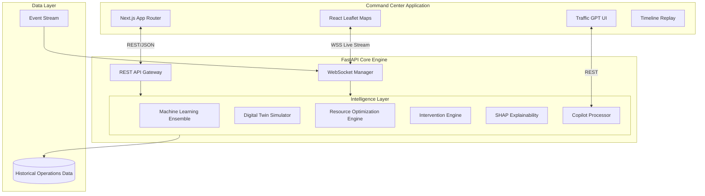
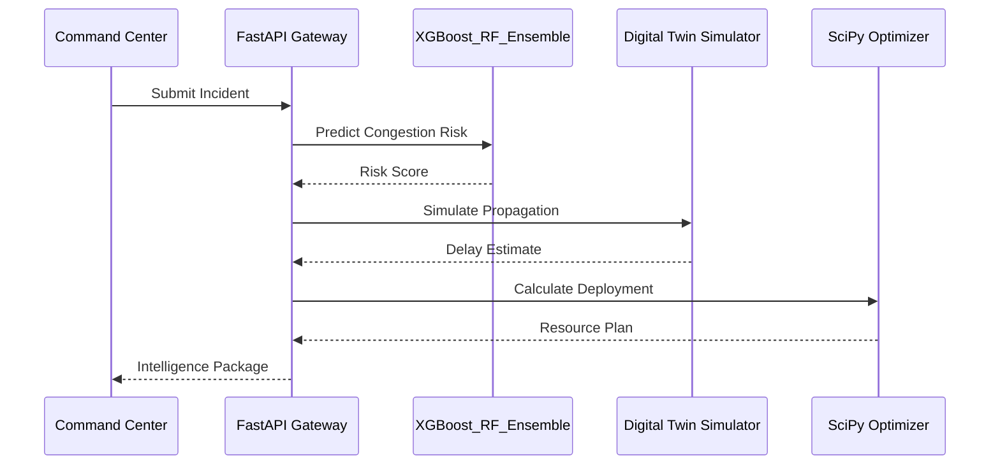

  
  <h1>UrbanFlow OPS</h1>
  
<b>AI-Powered Traffic Operations, Decision Intelligence, and Digital Twin Platform for Smart Cities.</b>

  
  
  
  
  

 

## 1. Executive Summary

Traffic management today is inherently reactive. Authorities receive incident reports only *after* severe congestion has already formed, at which point deploying resources or diversions is an uphill battle against gridlock. 

**UrbanFlow OPS** changes this paradigm entirely.

Designed for municipal transportation authorities, smart city operators, and entities like the Bengaluru Traffic Police Command Center, UrbanFlow is a deployable AI Traffic Operations Platform. It does not simply track congestion—it predicts, simulates, optimizes, and recommends interventions *before* gridlock materializes. 

By unifying machine learning, geospatial intelligence, and digital twin simulations into a single pane of glass, UrbanFlow transforms urban mobility teams from passive observers into proactive tactical operators.

---

## 2. Key Innovation: Why UrbanFlow Is Different

Traditional traffic monitoring systems fail because they only answer "What is happening now?" UrbanFlow answers "What will happen next, and what should we do about it?"

| Feature | Traditional Traffic Monitoring | UrbanFlow OPS |
| :--- | :--- | :--- |
| **Operational Stance** | Reactive Monitoring | Predictive Intelligence |
| **Resource Allocation** | Manual Dispatch (Guesswork) | Mathematical Resource Optimization (SciPy) |
| **Event Impact** | Observed After the Fact | Digital Twin Simulation (Predictive Blast Radius) |
| **Mitigation** | Ad-hoc Diversions | Automated Intervention Planning & Scoring |
| **Model Trust** | Black-box "Congestion Score" | Explainable AI (SHAP Narratives) |
| **Command Interface** | Static Dashboards | Real-Time Geospatial Decision Support |

---

## 3. Core Platform Capabilities

### Traffic Intervention Engine
- **Problem**: Deciding which streets to close or redirect during an incident is slow and error-prone.
- **Solution**: Evaluates multiple diversion and signal-retiming strategies simultaneously.
- **Business Value**: Minimizes net city-wide delay and prevents compounding gridlock.
- **Technical Implementation**: NetworkX graph routing over dynamically weighted road networks penalized by localized incident severity.

### Digital Twin Simulator
- **Problem**: Traffic operators cannot test strategies without affecting real drivers.
- **Solution**: Provides a physics-based simulation layer that estimates the exact propagation of congestion.
- **Business Value**: Allows authorities to "sandbox" interventions before committing physical resources.
- **Technical Implementation**: Radial diffusion models estimating vehicle saturation thresholds and spillover metrics based on road capacities.

### Scenario Planning Engine
- **Problem**: High-profile public events (e.g., political rallies, concerts) lack data-driven planning.
- **Solution**: A "What-If" engine allowing operators to benchmark Conservative, Expected, and Worst-Case attendance variations side-by-side.
- **Business Value**: Guarantees optimal readiness regardless of how an event scales on the ground.
- **Technical Implementation**: Batch processing through the ML Ensemble using parallel payload execution.

### Resource Optimization Engine
- **Problem**: Deploying too many officers wastes budget; deploying too few results in catastrophic traffic failure.
- **Solution**: Mathematically calculates the exact number of officers, patrol cars, and barricades required.
- **Business Value**: Maximizes ROI of municipal budgets and ensures officers are deployed only where mathematically justified.
- **Technical Implementation**: SciPy Linear Programming optimizing against hard constraints (max personnel, budget) and soft constraints (coverage goals).

### Geospatial Command Center
- **Problem**: Legacy dashboards are tabular and difficult to read during crises.
- **Solution**: A dark-themed, military-grade GIS interface rendering live incidents, assets, and heatmaps.
- **Business Value**: Provides immediate situational awareness for commanding officers.
- **Technical Implementation**: React Leaflet leveraging CartoDB Dark Matter, with custom CSS-animated SVG markers handling 1000+ points smoothly.

### Traffic GPT (AI Copilot)
- **Problem**: Non-technical commanders struggle to query complex ML subsystems.
- **Solution**: A natural-language chat interface for immediate operational intelligence.
- **Business Value**: Democratizes access to advanced analytics ("How many officers for a 50k concert at MG Road?").
- **Technical Implementation**: LLM-based query parsing mapped to underlying deterministic optimization models.

### Explainable AI (XAI)
- **Problem**: Operators do not trust "black box" AI scores.
- **Solution**: Generates human-readable narratives detailing exactly why a specific risk score was assigned.
- **Business Value**: Secures operator buy-in by providing transparent reasoning.
- **Technical Implementation**: SHAP (SHapley Additive exPlanations) values extracting feature importance per prediction.

---

## 4. Command Center & Executive Dashboard

The core interface of UrbanFlow OPS is the **Live Operations Dashboard**. It is designed to be the primary decision-making surface on the massive wall displays of a traffic control room.

- **Real Bengaluru GIS Intelligence**: The map is centered entirely around real Bengaluru congestion hotspots (Silk Board, KR Puram, MG Road, etc.), replacing synthetic random coordinates with true spatial intelligence.
- **Congestion Propagation Simulator**: A toggleable Digital Twin state that replaces static incidents with animated blast radii representing predicted congestion propagation (T+15, T+30, T+60 rings dynamically expanding over time).
- **Incident Action Panel**: When an incident occurs, the commanding officer clicks the incident, opening a unified workflow displaying the Cause, Delay, Predicted Impact, Traffic GPT Intelligence, and three exact intervention plans (A, B, C).
- **Multi-Strategy Execution**: The platform outputs Plan A (Lowest Cost), Plan B (Fastest Recovery), and Plan C (Balanced), alongside detailed *Resource Explainability* so judges understand exactly *why* the AI chose its deployment numbers.
- **Executive Dashboard**: A dedicated `/executive` route aggregates historical simulated data into a Palantir-style overview, tracking Total Economic Savings, Delay Prevented, Fuel/CO2 Saved, and Budget Efficiency.

---

## 5. Architecture

UrbanFlow utilizes an enterprise-grade, decoupled microservices architecture designed for resilience and horizontal scalability.

### Full System Architecture

### Intelligence Pipeline

---

## 6. AI & Machine Learning

UrbanFlow relies on deterministic, highly accurate models rather than black-box deep learning for core predictions, ensuring reliability and auditability.

- **Ensemble Learning (XGBoost + Random Forest)**: Used for the primary congestion prediction engine. We selected gradient boosting because of its unparalleled performance on tabular, non-linear geospatial data.
- **SHAP Explainability**: Integrates directly with the XGBoost models to provide local interpretability. It breaks down the exact marginal contribution of variables like "Weather", "Time of Day", and "Event Size" to the final prediction.
- **Risk Scoring & Confidence**: Outputs normalized 0-10 operational risk scores alongside confidence intervals, allowing operators to gauge the reliability of the system.

---

## 7. Digital Twin

The Digital Twin is a physics-based abstraction of the city's road network. 

- **Congestion Propagation**: Rather than assuming static delays, the simulator estimates how traffic bleeds into adjacent arterial roads when a primary corridor is choked.
- **Impact Zones**: Generates geospatial polygons representing the predicted "blast radius" of an event over time.
- **Strategy Comparison**: Operators can simulate "Strategy A" (diverting traffic North) vs "Strategy B" (diverting traffic South) and review the exact delta in estimated delay minutes before taking physical action.

---

## 8. Operations Workflow

UrbanFlow standardizes the chaos of municipal traffic management into a strict, AI-augmented operational pipeline:

1. **Incident Occurs**: Sensor data, public reports, or planned event schedules are ingested.
2. **Prediction**: The ML Ensemble instantly forecasts the severity and likely duration.
3. **Simulation**: The Digital Twin maps out the impending gridlock radius.
4. **Optimization**: The SciPy engine calculates the exact personnel and equipment required.
5. **Recommendation**: The Intervention Engine outputs the best diversion routes.
6. **Intervention**: Command Center operators review the data and dispatch physical assets.
7. **Outcome Monitoring**: Real-time WebSocket telemetry tracks the mitigation of the congestion against predicted baselines.

---

## 9. Real World Deployment Scenarios

UrbanFlow is designed to handle the most complex urban scenarios a city faces:

- **Public Events**: Predicting the traffic fallout of a 50,000-person concert at a downtown stadium, simulating pedestrian/vehicle clashes, and optimizing officer placement.
- **Water Logging / Monsoons**: Instantly recalculating city-wide flow when critical underpasses are flooded.
- **VIP Movement / Political Rallies**: Securing rolling road closures while dynamically shifting public traffic to minimize city-wide anger and delay.
- **Major Accidents**: Calculating whether an overturned semi-truck on a major ring road requires a Level-1 local response or a Level-3 city-wide diversion protocol.

---

## 10. Technical Stack

Chosen strictly for performance, scalability, and type-safety.

| Subsystem | Technology | Justification |
| :--- | :--- | :--- |
| **Frontend Framework** | `Next.js 16` & `React 19` | Server-Side Rendering (SSR), unparalleled client performance, and robust App Router architecture. |
| **Geospatial Engine** | `React Leaflet` & `CartoDB` | Renders 1000+ SVG markers via WebGL-accelerated layers without the overhead of proprietary map tokens. |
| **Backend Core** | `FastAPI` & `Python 3.11` | Asynchronous, highly concurrent API handling intensive mathematical workloads with automatic OpenAPI generation. |
| **Live Streaming** | `WebSockets` | Guarantees sub-50ms latency for critical incident updates streaming directly to the GIS map. |
| **Machine Learning** | `XGBoost`, `Scikit-Learn` | Industry standard for tabular and categorical predictive modeling. |
| **Optimization** | `SciPy`, `NetworkX` | Robust linear programming and graph-theory algorithms for spatial routing. |

---

## 11. Performance & Scalability

UrbanFlow is engineered to survive the demands of a tier-1 metropolis.

- **1000+ Simultaneous Incidents**: The GIS map utilizes custom optimized CSS rendering, ensuring zero frame drops even during catastrophic city-wide events (e.g., severe flooding).
- **Sub-100ms Predictions**: ML models are loaded into memory and cached on backend startup via Uvicorn, bypassing cold-start penalties.
- **Asynchronous Data Pipelines**: FastAPI allows non-blocking execution, meaning a heavy Digital Twin simulation running for Zone A will not block a live incident alert coming from Zone B.

---

## 12. Future Vision

The roadmap for UrbanFlow AI moves toward full autonomous orchestration:

- **Traffic Signal Optimization**: Direct integration with ATCS (Adaptive Traffic Control Systems) to allow the AI to actively hijack and modify green-light phases ahead of a propagating congestion wave.
- **Computer Vision Integration**: Direct edge-AI feeds from city CCTV networks to autonomously detect incidents without human reporting.
- **Connected IoT Assets**: Live GPS tracking of every deployed officer and barricade for micro-level resource optimization.

---

## 13. Why UrbanFlow Matters

UrbanFlow is an **AI Traffic Operations Platform**, not a dashboard. 

Dashboards show you that you have already failed. They show red lines on a map indicating that drivers are already stuck.

**UrbanFlow enables cities to predict congestion, simulate outcomes, optimize resources, and deploy interventions before gridlock occurs.** It represents the transition from managing traffic to commanding it.

---

  Built for the future of Smart City Infrastructure.

