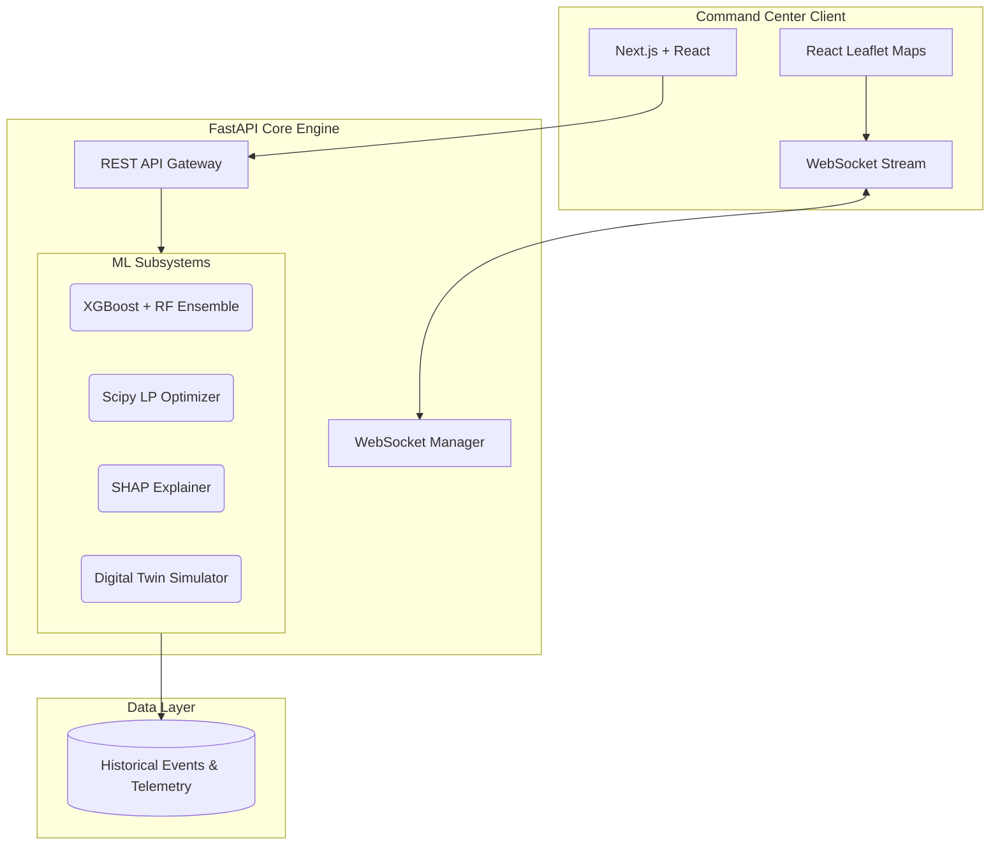

# UrbanFlow AI 🚦

<div align="center">
  <h3>Next-Generation Urban Traffic Command Center & Decision Intelligence Platform</h3>
  <p>Transforms reactive traffic monitoring into predictive, geospatial intelligence.</p>
</div>

---

## 📖 Overview

**UrbanFlow AI** is an enterprise-grade Decision Intelligence Platform designed for municipal transportation authorities, smart city operators, and traffic police command centers. Built to bridge the gap between raw data science and real-world tactical operations, UrbanFlow translates complex machine learning predictions into actionable geospatial intelligence and resource optimization schedules.

By shifting from traditional *reactive* monitoring to *predictive* simulation, UrbanFlow empowers command centers to visualize the future impact of urban events and deploy countermeasures before gridlock occurs.

## ✨ Core Capabilities

- **Predictive ML Engine**: Utilizes an ensemble of XGBoost and Random Forest algorithms to predict congestion severity and propagation based on historical event datasets, temporal features, and spatial embeddings.
- **Geospatial Command Center**: A high-performance, dark-themed React Leaflet mapping interface (rendering 1000+ incidents smoothly) offering real-time situational awareness, congestion heatmaps, and digital twin overlays.
- **Digital Twin Simulation**: Simulates the blast radius and congestion propagation of an event, estimating exact delay minutes and road saturation.
- **Linear Resource Optimization**: Leverages Scipy Linear Programming to output mathematically optimal deployment schedules for traffic officers, patrol cars, and barricades given hard constraints.
- **Explainable AI (XAI)**: Generates human-readable narratives using SHAP values to explain *why* the AI made a certain prediction, ensuring trust for human operators.

## 🏗️ System Architecture

UrbanFlow AI implements a decoupled, event-driven architecture, enabling independent scaling of the ingestion engine, predictive models, and client operations interface.



## 🛠️ Technology Stack

| Domain | Technologies |
| :--- | :--- |
| **Frontend** | React 19, Next.js 16 (App Router), Vanilla CSS (Custom Design System), Lucide Icons |
| **Geospatial** | Leaflet, React-Leaflet, Leaflet.heat |
| **Backend** | FastAPI, Uvicorn, Python 3.11+, Pydantic, WebSockets |
| **ML & Data** | Scikit-Learn, XGBoost, SHAP, Pandas, NumPy, NetworkX, SciPy |

## 🚀 Getting Started

### Prerequisites
- Node.js >= 18.x
- Python >= 3.11
- npm or yarn

### 1. Backend Initialization

The backend houses the machine learning models, simulation physics, and routing algorithms.

```bash
cd backend
python -m venv venv
source venv/bin/activate  # On Windows use `venv\Scripts\activate`

# Install dependencies
pip install -r requirements.txt

# Start the FastAPI engine
python main.py
```
> **Note:** Initial startup will take 5-10 seconds as the ML ensemble trains and caches the SHAP explainers in memory.

### 2. Frontend Initialization

The frontend provides the interactive operations dashboard and GIS maps.

```bash
cd frontend

# Install dependencies
npm install

# Start the Turbopack development server
npm run dev
```

### 3. Access the Platform
Navigate to `http://localhost:3000` to access the Command Center. The backend API documentation (Swagger UI) is available at `http://localhost:8000/docs`.

## 📂 Repository Structure

```text
UrbanFlow-AI/
├── backend/                  # Core Python/FastAPI engine
│   ├── api/routes.py         # REST and WebSocket endpoints
│   ├── ml_engine.py          # XGBoost & Random Forest pipeline
│   ├── digital_twin.py       # Propagation simulation physics
│   ├── resource_optimizer.py # Scipy linear programming
│   ├── explainability.py     # SHAP-based model introspection
│   └── main.py               # Uvicorn entry point
├── frontend/                 # Next.js Command Center
│   ├── src/app/              # Next.js App Router views
│   ├── src/components/       # Reusable React components
│   │   ├── GISOperationsMap.js # Core React Leaflet Map
│   │   └── MapWrapper.js     # Dynamic SSR wrapper for map
│   └── src/styles/           # Global and modular CSS
└── README.md
```

## 📜 License

This project is licensed under the MIT License. See the `LICENSE` file for details.
